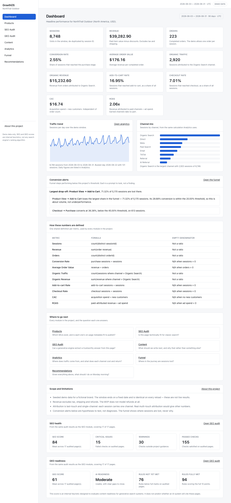

# GrowthOS — DTC 独立站增长决策系统

一个面向 DTC 独立站运营的 SEO / GEO / Content / Analytics / Funnel / Recommendations 决策工作台。用虚构的北美户外品牌 **NorthTrail Outdoor** 的可复现演示数据驱动，所有页面明确标记 Demo data。



> **这是一个作品集项目，不是生产系统。** 数据由固定 seed 生成，窗口结束日是常量而非今天。项目中没有任何一个数字代表真实业绩，SEO / GEO 分数是本项目自己写的规则，不是任何搜索引擎的排名算法。完整的能力边界见应用内的 About this project 页面（[截图](docs/screenshots/12-about-project.png)），以及本文的[已知限制与未来规划](#已知限制与未来规划)。

---

## 目录

- [业务背景与要解决的问题](#业务背景与要解决的问题)
- [功能模块](#功能模块)
- [技术架构](#技术架构)
- [SEO / GEO 评分设计](#seo--geo-评分设计)
- [数据模型](#数据模型)
- [核心指标口径](#核心指标口径)
- [安装、运行与测试](#安装运行与测试)
- [截图](#截图)
- [演示路径与讲解提纲](#演示路径与讲解提纲)
- [已知限制与未来规划](#已知限制与未来规划)
- [开发任务索引](#开发任务索引)

---

## 业务背景与要解决的问题

独立站运营每周都要回答同一个问题——**这周该做什么**——但证据散落在互不相通的工具里：搜索后台一套口径、分析工具另一套、广告平台第三套、商品目录又在别处。每个工具内部自洽，彼此对不上，结果是决策往往依据"最容易找到的那个数字"。

GrowthOS 针对四类具体的失效方式设计：

| 失效方式 | 本项目的做法 |
|---|---|
| **同一个词两种含义**——转化率可以按会话、按用户、按访问；营收可以含税含运费也可以不含 | 每个比率只定义一次（`src/domain/metrics.ts`），所有模块 import 同一个实现。集成测试断言 Dashboard 与 Analytics 的渠道数据深度相等 |
| **给个分数但不给理由**——工具说这页 62 分，没有反驳的余地 | 每个分数都能拆成具名检查项：通过 / 警告 / 失败、判定依据的证据、规则版本号。规则配置在仓库里，可以被质疑 |
| **发现变不成行动**——审计产出列表，列表产出空气 | 每个发现都变成一条带优先级、估算和回跳链接的任务，完成状态跨刷新保存 |
| **把相关当因果**——漏斗显示某步流失高，于是断言原因 | 漏斗只回答"在哪里流失"。所有建议用 "may" 措辞并附"如何验证"，单元测试断言这个措辞 |

## 功能模块

| 模块 | 回答的问题 | 关键能力 |
|---|---|---|
| **Dashboard** | 这个窗口生意是否健康，该先看哪里？ | 11 个核心指标 + 口径表、流量趋势、渠道构成、转化告警、跨模块导航 |
| **Products** | 有哪些 SKU，每个的 on-page 元数据是否可以发布？ | 17 个 SKU 的目录、搜索筛选、可编辑 SEO 元数据（保存后同步对应 PageSnapshot 并把已有审计标记 stale） |
| **SEO Audit** | 这个页面对传统搜索是否技术合格？ | 12 条规则（元数据、H1/标题层级、关键词使用、图片 alt、内链、canonical、robots/indexability、结构化数据），0–100 分 |
| **GEO Audit** | 生成式引擎能不能从这页抽出可信答案？ | 10 条规则（直接回答、事实密度、来源证据、FAQ、语义结构、schema 等），0/5/10 计分，三档 readiness |
| **Content** | 下一篇该写什么，为什么是它？ | 选题计划，机会分 = 0.35×SEO + 0.25×GEO + 0.20×商业意图 + 0.20×商品相关度，各项可解释可编辑 |
| **Analytics** | 流量从哪来，每个渠道花多少、回多少？ | 渠道表（sessions / users / revenue / orders / CVR / AOV / CAC / ROAS）、每日趋势、低样本标记 |
| **Funnel** | 旅程中会话在哪一步丢失？ | 会话级漏斗、逐层去重计数、阶段转化与流失率、最大流失点、带验证方法的假设 |
| **Recommendations** | 综合以上，周一早上该做什么？ | 汇总五类来源的统一任务清单，稳定 ID、影响/工作量四象限、证据、深链、完成状态持久化 |
| **About this project** | 我在看什么，该信到什么程度？ | 动机、问题、模块关系、模型局限、演示路径、**demo reset** |

## 技术架构

实际使用的版本（在 Dispatch 0 锁定）：

| 层 | 选型 |
|---|---|
| 框架 | Next.js 16.3.5（App Router、Turbopack） |
| UI | React 19.3、Tailwind CSS 4 |
| 语言 | TypeScript 6.0.3（strict + `noUncheckedIndexedAccess` + `exactOptionalPropertyTypes` + `verbatimModuleSyntax`），零 `any`（lint error 级别） |
| 校验 | Zod 4 |
| Lint | ESLint 10 + eslint-config-next（flat config） |
| 测试 | Vitest 5（unit + integration 两套配置）、Playwright 1.63 |
| 图表 | **无图表库**——手写内联 SVG，每张图配完整数据表与文本摘要 |
| 持久化 | 浏览器 localStorage + `schemaVersion`，命名空间隔离 |

分层（依赖只能向下）：

```
app/          路由与页面组装，只负责渲染与交互协调
components/   展示组件，不含业务规则
services/     组合 repository 与 domain，返回可直接渲染的结果
repositories/ 数据访问边界（browser / memory / 各类故障适配器）
fixtures/     确定性演示数据
domain/       纯函数：指标、金额、规则引擎、格式化。不依赖任何上层
```

**为什么没有数据库。** MVP 不需要。repository 层存在的理由只有两个：SSR 阶段取不到 localStorage，以及测试需要一个非 localStorage 的后端。服务合同已经定义好，换成 Prisma/PostgreSQL 时不需要改 domain 与 UI。

几条贯穿全项目的约定：

- **金额一律整数分**，`assertCents` 拒绝小数；`apportionCents` 保证分摊之和等于总额。除法结果（CAC、AOV）用 `formatMoneyMetric`（会取整），不能用 `formatCents`。
- **分母为 0 返回 `null`**，UI 显示 N/A，永不产生 Infinity/NaN。有效分母下的零分子是真实的 0。
- **汇总先加分子分母再相除**，禁止对比率直接求平均。
- **不在渲染时随机造数**。E2E 断言两次加载的指标完全一致。
- **审计 stale 由指纹推导**（FNV-1a 的 `inputFingerprint`），不是存一个 flag——flag 会忘记更新，指纹不会。
- **`?demo=` 是 QA 接缝**：`empty | error | slow | flaky | storage-error`，闭合白名单，未知值回落真实 fixture，界面不链接到它。

## SEO / GEO 评分设计

两套引擎结构相同：`config.ts`（阈值与权重）+ `rules.ts`（纯函数规则）+ `engine.ts`（组装与计分），都带版本号。

**SEO（`seo-1.0.0`，12 条规则）** 计分为 `通过 1 / 警告 0.5 / 失败 0`，**Unknown 同时排除出分子和分母**——数据不全时不该按失败算，也不该按通过算。

关键词使用规则采用两级匹配：逐字出现，或词覆盖率 ≥ 50%。最初只做逐字匹配，结果把 "Ridgeline 2P Backpacking Tent" 判成与 "2 person backpacking tent" 无关，产生 12 条假失败。规则的目标本来就是"这页是否在讲这个关键词"，所以改的是规则而不是断言。

**GEO（`geo-1.0.0`，10 条规则）** 每条 0 / 5 / 10 分，readiness 分 80 / 55 / 30 三档。**不调用任何 AI API**，检查的是页面结构是否便于抽取答案（直接回答句、事实密度、来源证据、FAQ、schema），**不声称能测量真实的 AI 排名或引用概率**。

## 数据模型

```
Product ──1:1── PageSnapshot ──*── AuditResult(seo|geo)
   │                                      │
   └── ContentIdea(targetProductId)       └── Recommendation(source, ruleId)
                                                      │
SessionFact ──0:1── Order ──*── OrderItem      RecommendationStatus(只存 Done)
   │
ChannelSpend(每渠道每天一条)
```

- `SessionFact` 记录 sessionId、userId、日期、channel、source、landingPageId、**按顺序发生的漏斗阶段**、viewedProductIds 与可选 orderId。每会话至多一笔订单。
- 会话只有一个归因渠道，因此渠道的 sessions / orders / revenue 与全站总计对齐；**但用户数跨渠道重叠，相加会大于全站去重总数**，界面明确说明这一点。
- 商品营收按订单行分摊，全商品营收之和等于订单营收。
- `Product` 的 seoScore / geoScore / organicSessions / conversionRate / revenue 是**派生视图字段**，表单不能手工修改。
- `AuditResult` 存 `inputFingerprint`；`stale` 是比对出来的，不是存的。
- `RecommendationStatus` **只存 `{ id, status, updatedAt }`**——任务本身每次重新生成，因此不可能与引擎当前判断脱节。

固定窗口：**2026-06-03 — 2026-08-31**，90 天，含首尾，UTC。`demoAsOf` 是常量。

## 核心指标口径

| 指标 | 公式 | 约定 |
|---|---|---|
| Conversion Rate | 购买会话数 ÷ sessions | MVP 一会话最多一单 |
| AOV | revenue ÷ orders | 除法结果，可能有小数分 |
| Organic Traffic / Revenue | channel = Organic Search 的 sessions / revenue | |
| Add-to-cart / Checkout Rate | 到达该阶段的去重会话数 ÷ sessions | |
| CAC | acquisitionSpend ÷ newCustomers | **独立于订单数**；acquisitionSpend ⊇ adSpend |
| ROAS | paidAttributedRevenue ÷ adSpend | 非付费渠道 N/A；站点 ROAS 只计入买了媒体的渠道所带来的营收 |
| Stage Conversion / Drop-off | 下一阶段 ÷ 上一阶段；1 − 该值 | 全程同一批会话，后续阶段必须按序发生 |

Revenue = 已支付订单的商品金额扣折扣，**排除税、运费、退款**。MVP 不建模退款。

## 安装、运行与测试

需要 Node 20+（开发环境实测 Node 24.18 / npm 11.16）。

```bash
npm ci
npx playwright install chromium
npm run dev
```

开发服务器默认 <http://localhost:3000>，会重定向到 `/dashboard`。**无需数据库、无需环境变量、无需任何外部服务。**

全部质量门禁：

```bash
npm ci
npm run lint
npm run typecheck
npm run test -- --run
npm run test:integration -- --run
npm run test:e2e
npm run build
```

- `test` 是 Vitest 单元测试（纯 domain 函数），`test:integration` 跑 service + repository 与真实 localStorage 的往返。
- `test:e2e` 用 Playwright，**跑的是生产构建**（`npm run build && next start`，端口 3100）而不是 dev server——dev 的 HMR 流量会污染 console 断言，而且构建产物才是真正要发布的东西。E2E 使用独立存储命名空间 `growthos.e2e`。
- 端口冲突可用 `E2E_PORT` 覆盖。

重新生成截图（会写入 `docs/screenshots/`，不属于门禁）：

```bash
npm run screenshots
```

性能测量（对生产构建实测浏览器自己上报的导航计时与传输字节，只打印不断言）：

```bash
npm run perf
```

不做阈值断言是刻意的：在开发机上对毫秒数设断言只会得到一个不稳定且没有信息量的门禁。实测结果记录在 [Dispatch 9 报告](docs/reports/dispatch-09.md)。

**清空演示数据**：打开应用内 About this project 页面底部的 Demo data 面板。这是全项目唯一会清除存储的入口，需要二次确认，且只删除本项目命名空间下的键。

## 截图

| | |
|---|---|
| [Dashboard](docs/screenshots/01-dashboard.png) | [Products](docs/screenshots/02-products.png) |
| [Product detail](docs/screenshots/03-product-detail.png) | [SEO overview](docs/screenshots/04-seo-overview.png) |
| [SEO page detail](docs/screenshots/05-seo-page-detail.png) | [GEO overview](docs/screenshots/06-geo-overview.png) |
| [GEO page detail](docs/screenshots/07-geo-page-detail.png) | [Content planner](docs/screenshots/08-content-planner.png) |
| [Analytics](docs/screenshots/09-analytics.png) | [Funnel](docs/screenshots/10-funnel.png) |
| [Recommendations](docs/screenshots/11-recommendations.png) | [About this project](docs/screenshots/12-about-project.png) |
| [Dashboard @375px](docs/screenshots/13-dashboard-375px.png) | [Mobile navigation](docs/screenshots/14-mobile-navigation.png) |

## 演示路径与讲解提纲

约 5 分钟。应用内 About this project 页面有同一份路径。

1. **Dashboard（40s）**——先看口径表，不是先看数字。讲点：每个比率只有一个定义，所有模块共用。
2. **Products → 一个 SKU（60s）**——改标题或 meta，保存，刷新，编辑还在。讲点：写入失败会保留输入，只有成功才显示成功；这次编辑让对应页面的已有审计变成 stale。
3. **SEO Audit → 重新审计（50s）**——走一条失败的检查项。讲点：给的是理由和证据，不是分数；Unknown 不计入分母。
4. **GEO Audit（40s）**——讲 readiness 三档。**主动说明**：这测的是页面结构，不是真实 AI 排名，全项目不调用 AI API。
5. **Analytics → Funnel（60s）**——渠道表的 CAC 与 ROAS，然后漏斗。讲点：自然渠道 CAC 是 $0.00 因为没给它分摊成本，这是算术不是结论；最大流失点不等于最大问题（商品页→加购在任何店铺都会丢掉大部分人）。
6. **Recommendations（70s）**——整个项目在这里收口。讲点：稳定 ID、只存"完成"决定、草稿商品的问题会被降权而不是隐藏、影响/工作量是估计不是收益承诺。标记一条完成，刷新，它还在。

**面试可以主动展开的几个点：**

- 为什么审计 stale 用指纹推导而不是存 flag。
- 为什么 `assertCents` 值得存在：它在 Dispatch 8 抓到了一个真实缺陷（CAC/AOV 是除法结果却调了要求整数分的格式化函数），把一个会静默输出错误金额的 bug 变成了硬错误。
- 为什么漏斗建议的触发条件是"低于阈值 **或** 是最大流失"：两者回答不同问题。
- 为什么图表不用图表库：每张图都必须配完整数据表和文本摘要，图表只是摘要的可视化。
- 三次靠肉眼而非测试发现的缺陷：关键词规则的假失败、375px 下 452px 的横向溢出（`sr-only` 绝对定位逃出了 `overflow-x` 裁剪）、草稿商品的问题排到了任务清单第一位。

## 已知限制与未来规划

**当前限制**（同样列在应用内 About 页）：

- 数据为 seed 生成，窗口结束日固定；没有任何真实业绩。
- SEO / GEO 是本项目的规则，不是搜索引擎算法；GEO 不测量真实 AI 引用。
- 归因为 last-touch 单渠道；真实多触点归因会给出不同的渠道 ROAS。
- Revenue 不含税、运费，**完全不建模退款**。
- 影响/工作量是 1–5 估计，不是收益预测。
- 自然渠道 CAC 为 $0.00 是因为没给它分摊成本，不代表免费。
- 影响分按规则类别取常量，不随页面流量加权（未发布商品会降权）。
- 任务只有 Open / Done，没有"忽略/不适用"。
- 没有商城、结账、登录、多租户、后台任务，不连任何外部 API，不爬取任何网站。
- E2E 只在 Chromium 上跑过；未做屏幕阅读器实测。

**未来规划**（均未实现）：

- 按商品级流量为影响分加权，让高流量页面的同类问题排在前面。
- 任务增加"忽略/不适用"状态与忽略理由。
- 多触点归因模型，并与 last-touch 并排对比。
- 退款与毛利建模，让 CAC / ROAS 对得上真实盈亏。
- 接入真实数据源适配器（GA4 / Shopify / Search Console），保持现有服务合同不变。
- 用 Prisma + PostgreSQL 替换浏览器存储适配器。
- Firefox / WebKit E2E 与屏幕阅读器实测。

## 开发任务索引

项目按 Dispatch 0–9 逐阶段构建，每阶段的实测报告在 [`docs/reports/`](docs/reports/)。

- [长期开发规则](CLAUDE.md) · [原始总 Prompt](docs/MASTER_PROMPT.md) · [架构与实施记录](docs/00-architecture.md)
- [0 架构](docs/00-architecture.md) · [1 Dashboard](docs/01-dashboard.md) · [2 商品中心](docs/02-products.md) · [3 SEO Audit](docs/03-seo-audit.md) · [4 GEO Audit](docs/04-geo-audit.md)
- [5 Content Planner](docs/05-content-planner.md) · [6 Analytics](docs/06-analytics.md) · [7 Conversion Funnel](docs/07-funnel.md) · [8 Recommendations](docs/08-recommendations.md) · [9 Portfolio Polish](docs/09-portfolio-polish.md)
